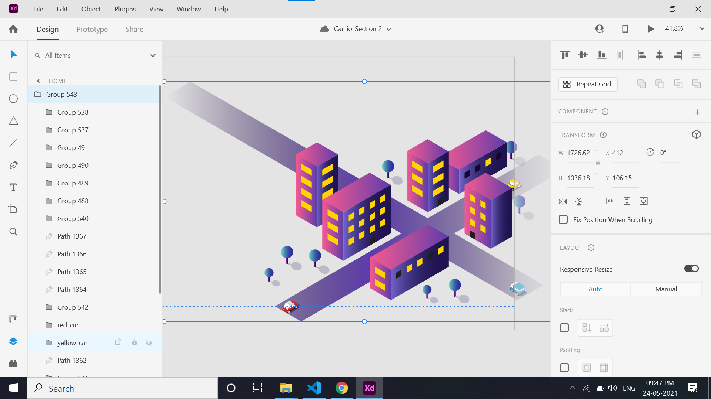
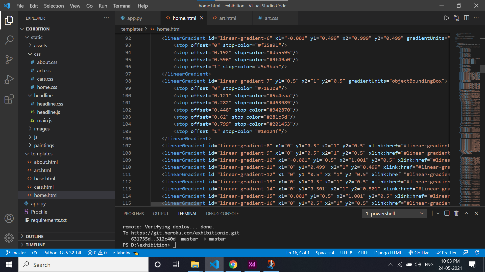
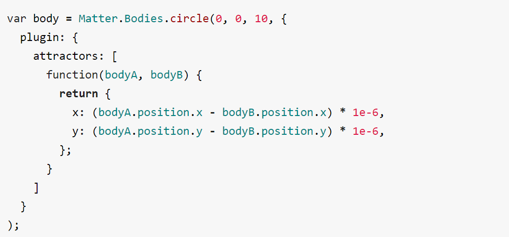

<h1>Exhibition .io</h1>
Here's a guide on how this website is constituted.

Link to the website : https://exhibitionio.herokuapp.com/
<h4>!!IMPORTANT : Don't scroll using keyboard up and down keys in the website.</h4>
<h5>Time to complete the website : 120 hrs</h5>
<h3> Main Page : </h3>

Sources % Technologies used:

<ul> 
  <li>Tweeenmax from GSAP : https://greensock.com/gsap/</li>
  <li>Google fonts and Fonts Cdn</li>
  <li>Skrollr js plugin : To enable scrolling from mouse : https://cdnjs.com/libraries/skrollr</li>
  <li>Loading Page image : wallpaperaccess </li>
  <li>Vector SVG Image : https://www.vectorstock.com/</li>
  <li>matter js , matter attractor js plugin : For 3rd Section (Art Section) : https://brm.io/matter-js/  and https://www.npmjs.com/package/matter-attractors/v/0.1.4
</ul>
<h2>Important Concepts Explained :</h2>
<ul>Q.) How to create loading animation ?</ul>
<li>With Tweenmax from GSAP it could be done by using to and from methods available</li>
<li>To means where to end and from means where to begin the components to be animated</li> 
<ul>Q.) How to create the SVG car animation ?</ul>
<li>Step 1: Find the svg of desire. Source mentioned above (like : https://www.vectorstock.com/ )</li>
<li>Step 2: Open the svgs inside adobe xd and align the svgs as desired</li>
<li>Step 3: IMPORTANT : In the layers panel make sure to keep the car go behind the buildings. Press [ or ] + tab key to move up or down the layers.</li>
 
<li>Step 4: Export the design as svg file and enable embedding. This will convert the whole group into html codes to be used in our website.</li>
<li>Like this:</li>

<li>Step 5: For animation of car use GSAP and target the Translate X and Y properties. Use hit and trial method to find the perfect angle.</li>
<li>Refer this tutorial on youtube for better understanding: https://youtu.be/goI6JHO99Qg</li>

<ul>Q.) How to create section 3 (Art io) animation ?</ul>
<li>This is basic usage of matter js and matter attractors js plugin (sources given above)</li>
<li>The plugin still offers some freedom on the shape,size and colour of the matter created.</li>
<li>Basic syntax for matter attractors body which will attract other matters :</li>

<li>Refer the documentation for better understanding.</li>

<h2>CARS iO PAGE</h2>
<h4><ul>Q.) How to add 3d model ?</ul></h4>
<li>Step 1: Find a free 3d model. Source to find : https://sketchfab.com/</li>
<li>Step 2: Download the model in gltf format</li>
<li>Step 3: To use the model in website. Use the service of https://modelviewer.dev/</li>
<li>Model viewer enables the model to be used as html element with various attributes and properties which we can alter.</li>
<li>Refer the documentation for better understanding. This is the simplest documentation anywhere to be found.</li>

<h4><ul>Q.) How to make the slider ?</ul></h4>

<li> Using the plugin swiper js : https://swiperjs.com/</li>
<li>Swiper js enables to create and customize the sliders on how we want to animate.</li>
<li>Varierty of methods for slider animation (two way, parallax, lazy, transition effects) is given simply in the documentaion.</li>
